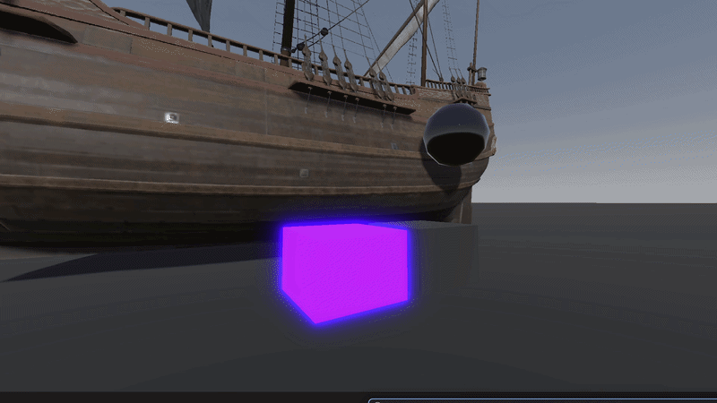
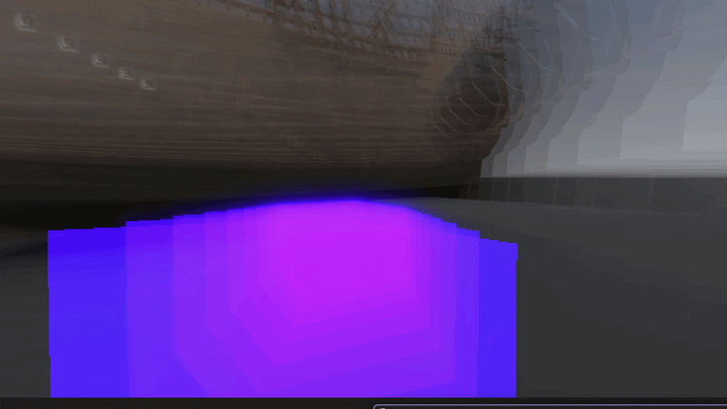
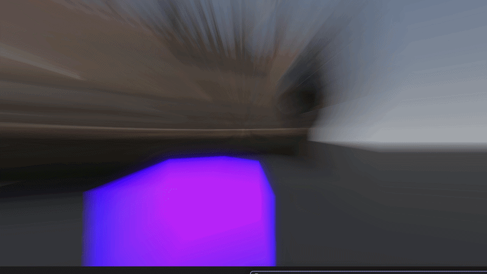
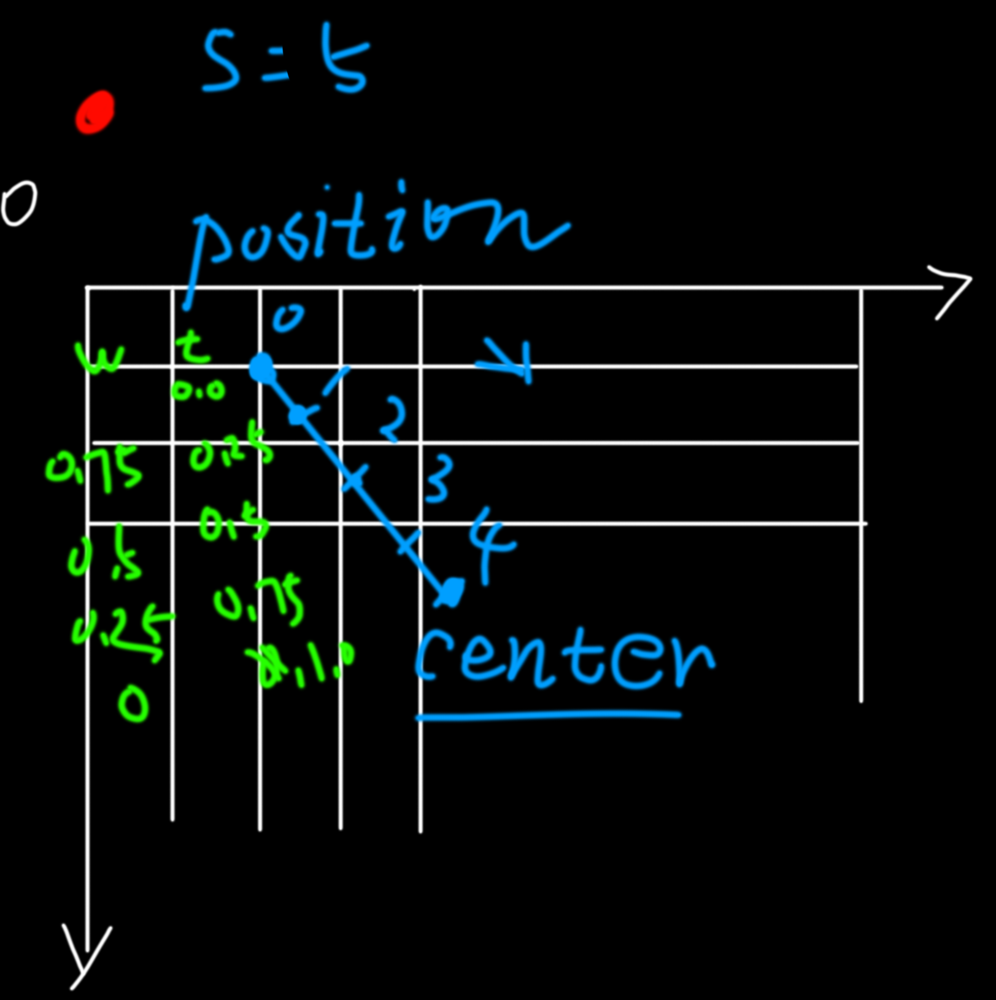
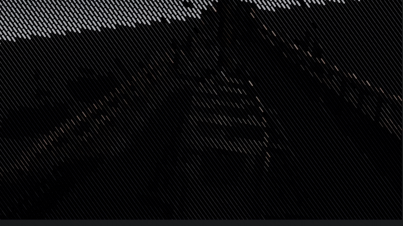
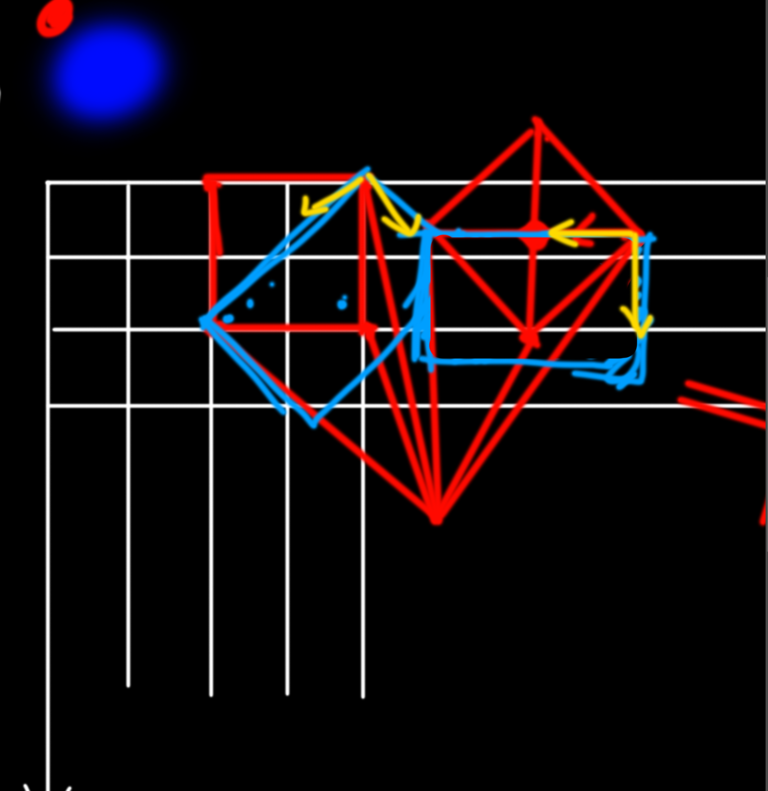

[Project URL ](https://github.com/Evtr0na/gdshader_pixel_shader_demo)


# Godot Shader Demo

The Project is divided into multiple levels,each containing small case studies.

---

## Level_6

#### Different Strength

#### Different Sample_count:

#### Different Center :


### Features

- 实现Radial Blur基础逻辑
- 可调整中心位置
- 可调整强度
- 采样数量

### Principle

采样position 到 center 中间的点，rgba相加求平均,实现径向模糊

```glsl

	for ( int i = 0 ; i < sample_count  ; i++ ){
        float t = float( i )/float( sample_count );
        ...
        vec2 sample_id_nor = mix(p,center,t*strength);//normalize id
        ...
        sum += sample_color;//sum color
    }
	vec4 color = sum/( weight_sum );
```



---
## Level_5



### Features

- 该 level 包含基于把多个像素颜色涂成 cell 中心颜色，实现简单像素效果，
- 通过在 cell 内部建立单独坐标系绘制不同的 cell 形状，实现一些视觉波普老式印刷风格
- 通过旋转实现偏移采样，实现 cell 形状的旋转排列

### importance:

如图蓝色为cell坐标所表示的矩形，右侧是旋转过去以后，画了个蓝色矩形,
判断有多少个旋转点位于这个已经旋转后的空间里的矩形内将会取色中心点

再旋转回来，左侧为有右侧旋转回来的样子

这样就达成了旋转的目的

```glsl
	float rotation_value_ = float( params.rotation_value );
	vec2 rotated_p = rotate_2d(vec2( p + 0.5*scale),radians(rotation_value_));
	
	float block_size = max(params.pixel_size,1);
	float block_span = float( block_size )*scale;
	vec2 cell = floor(rotated_p/block_span);
	vec2 pixelate_p = ( cell+0.5 )*block_span;
```




