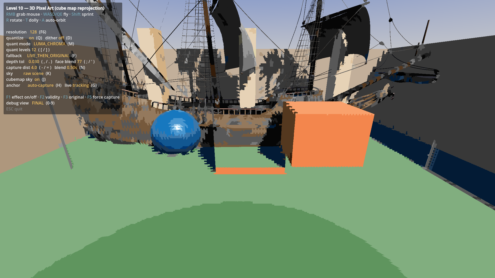
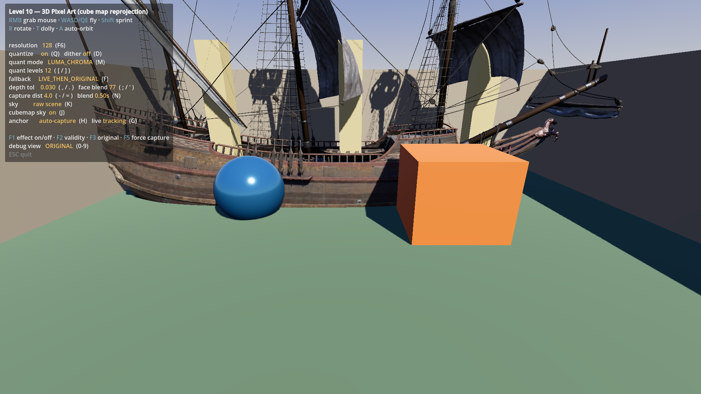
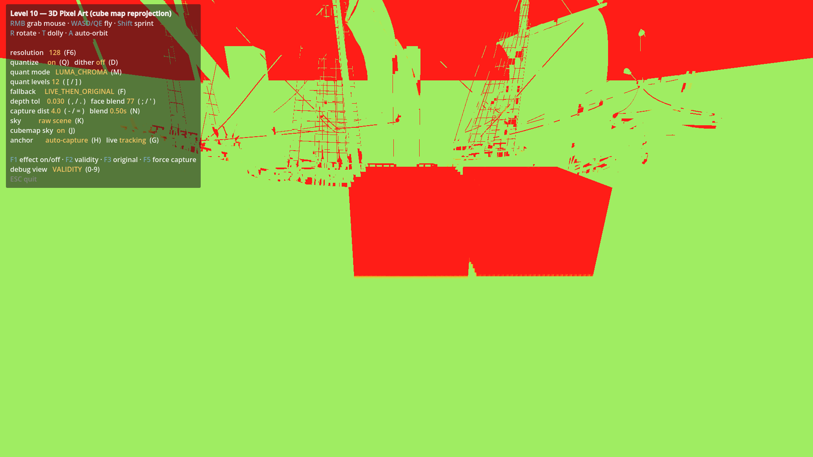
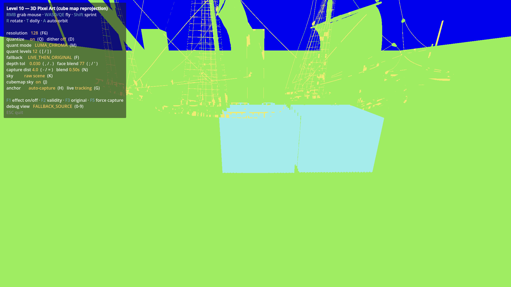

[Project URL ](https://github.com/Evtr0na/gdshader_pixel_shader_demo)


# Godot Shader Demo

The Project is divided into multiple levels,each containing small case studies.

---

## Level_10

#### 3D Pixel Art — Project Shadow Glass 风格 cubemap 重投影



原始画面 vs 像素化效果:

|  |  |
|---|---|
| 原始渲染 | 最终效果 |

调试视图:

|  |  |
|---|---|
| VALIDITY（红=遮挡解除） | FALLBACK_SOURCE（回退来源）|

### Features

- 六 SubViewport + 六相机 → cubemap，**旋转时零闪烁**
- 深度写进 alpha 通道（径向深度 + 天空哨兵），用于遮挡校验
- **双 anchor cubemap 交叉淡入**，逐像素按有效性加权 → 平移时也稳定
- 三种回退模式：原始画面 / Live cubemap / 两者结合
- 像素化：nearest 采样 + Bayer 抖动 + 三种量化模式（naive / luma / luma-chroma）
- 像素化天空、武器层排除
- 8 种调试视图（有效性、面号、回退来源、深度误差……）
- 完整 HUD 与实时参数调节

### Principle

**为什么直接降采样会闪**：像素格在屏幕空间，几何体在世界空间，相机一动边缘就跨格跳变。

**核心技巧**：不移动 cubemap，而是让它"变形"。在固定位置拍一张 cubemap（anchor），
相机移动时用深度反推每个像素的**世界坐标**，再算出采样方向：

```glsl
vec3 delta = world_pos - anchor_center;
float expected = length(delta);
vec3 dir = delta / expected;
CubeSample s = sample_cube_atlas(anchor_atlas, dir, res);

// 用 cubemap 里存的径向深度校验：差距太大说明当初被挡住了
float error = abs(s.radial_depth - expected);
float tol = max(occ_abs, expected * occ_rel);
valid = 1.0 - smoothstep(tol, tol * softness, error);
```

因为 anchor 的纹素在世界空间固定，**同一个表面点永远查到同一个纹素** → 平移不闪。
相机离 anchor 太远时重拍一张，新旧两张按 `valid` 加权交叉淡入，遮挡解除的区域
自动回退到 Live cubemap 或原始画面。

详见 [`level_10_/reference/implementation.md`](./level_10_/reference/implementation.md)。

### 实测验证

| 检查项 | 结果 |
|---|---|
| 重投影正确性（与原始画面相关性）| **0.914** |
| 像素化（8px 平坦邻域比）| 78.7% → **88.6%** |
| **旋转稳定性**（画面波动，越低越稳）| 像素化 **0.03** vs 原始 **0.09** |
| disocclusion 检出率 | **24.6%** |
| 地面使用 anchor 重投影的比例 | **100%** |
| 异常暗像素（细几何体，隐藏船模型后）| 83 → **0** |

### 视觉闭环迭代要点

用 `tools/look_at_frame.cjs` + `tools/pixel_diff.cjs` 逐轮对比后修掉的：

- **面间无缝混合**：立方体面边界有硬直角，改为按轴向对齐度加权混合三个轴对
  （`face_blend_sharpness = 77`，与参考实现同值）。软混合（8）会满屏**对角斜纹**。
- **容差必须按像素距离缩放**：只按相机到探针距离缩放时，浅角度地面被整体拒绝 ——
  实测地面 **55–60%** 退回原始画面（`FALLBACK_SOURCE` 视图大片黄色），
  地面因此完全不像素化。改为 `abs + expected*rel + cam_dist*probe_rel`。
- **面间混合必须按深度门控**：深度只校验主面、颜色却混合三个面时，
  邻面的纹素看到了别的物体会把它的颜色混进来。
- **抖动默认关闭**：全局 Bayer 抖动会在每个平面上都加规则图案，
  128px 下读起来是噪点而不是质感。

### 一个测量陷阱

视觉模型曾两次报告"橙色泄漏到绿色地面"。逐像素采样后确认是**误报**：
那个橙色块本来就是场景里的遮挡物方块（原始画面与效果都是橙色）。
原因是 demo 里遮挡物摆动太快，相隔几秒拍的两张图它已经移位 ——
模型看到的是"时间差"而不是"效果差"。已把摆动速度从 0.9 降到 0.22。

**结论**：A/B 视觉对比时场景不能有快速运动物体；判定"泄漏"要逐像素采样，
不能只靠模型描述。

### 操作

`R` 旋转 · `T` 推拉 · `A` 自动环绕 · `Q`/`D` 量化/抖动 · `M` 量化模式 · `F` 回退模式 ·
`;`/`'` 面间混合锐度 · `,`/`.` 深度容差 · `0-9` 调试视图 · `F6` 切分辨率 · `ESC` 退出

---

## Level_6

#### Different Strength

#### Different Sample_count:

#### Different Center :


### Features

- 实现Radial Blur基础逻辑
- 可调整中心位置
- 可调整强度
- 采样数量

### Principle

采样position 到 center 中间的点，rgba相加求平均,实现径向模糊

```glsl

	for ( int i = 0 ; i < sample_count  ; i++ ){
        float t = float( i )/float( sample_count );
        ...
        vec2 sample_id_nor = mix(p,center,t*strength);//normalize id
        ...
        sum += sample_color;//sum color
    }
	vec4 color = sum/( weight_sum );
```


---
## Level_5


### Features

- 该 level 包含基于把多个像素颜色涂成 cell 中心颜色，实现简单像素效果，
- 通过在 cell 内部建立单独坐标系绘制不同的 cell 形状，实现一些视觉波普老式印刷风格
- 通过旋转实现偏移采样，实现 cell 形状的旋转排列

### importance:

如图蓝色为cell坐标所表示的矩形，右侧是旋转过去以后，画了个蓝色矩形,
判断有多少个旋转点位于这个已经旋转后的空间里的矩形内将会取色中心点

再旋转回来，左侧为有右侧旋转回来的样子

这样就达成了旋转的目的

```glsl
	float rotation_value_ = float( params.rotation_value );
	vec2 rotated_p = rotate_2d(vec2( p + 0.5*scale),radians(rotation_value_));
	
	float block_size = max(params.pixel_size,1);
	float block_span = float( block_size )*scale;
	vec2 cell = floor(rotated_p/block_span);
	vec2 pixelate_p = ( cell+0.5 )*block_span;
```


